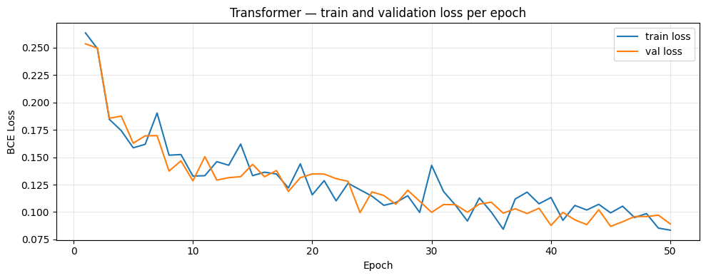
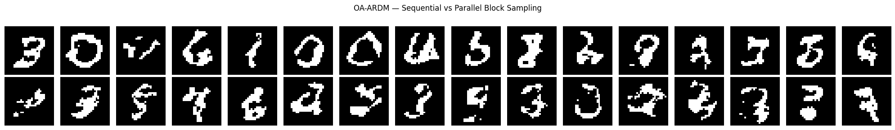
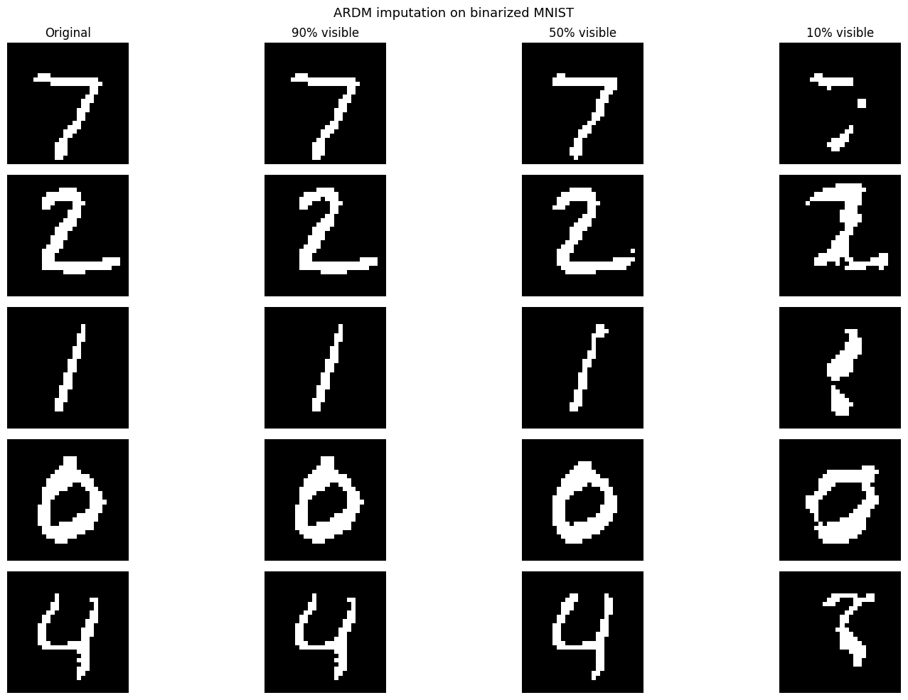
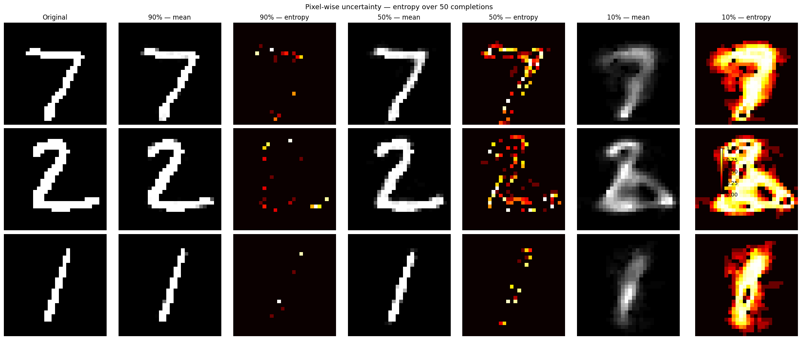
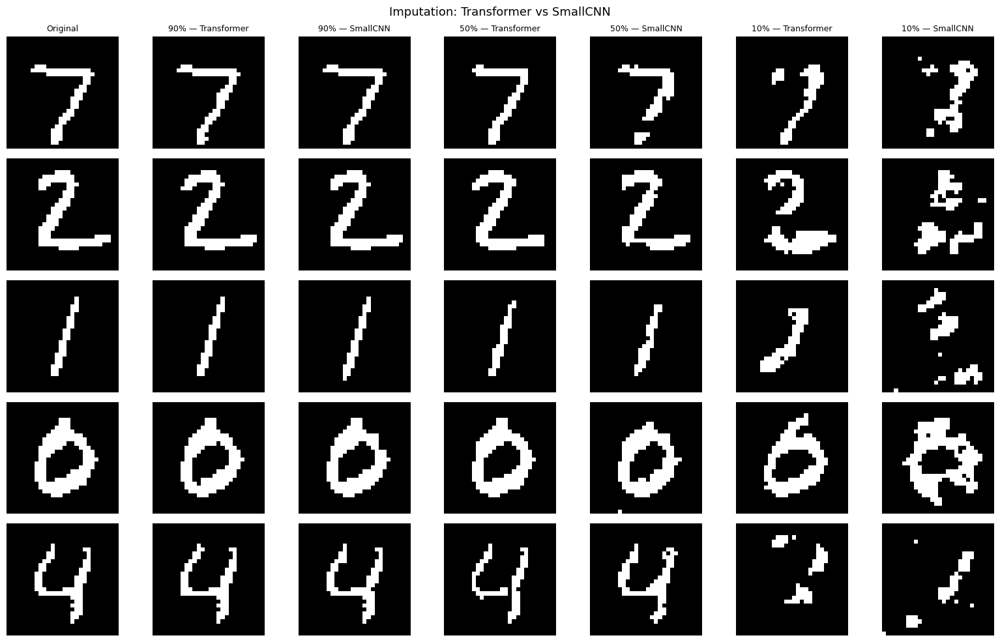
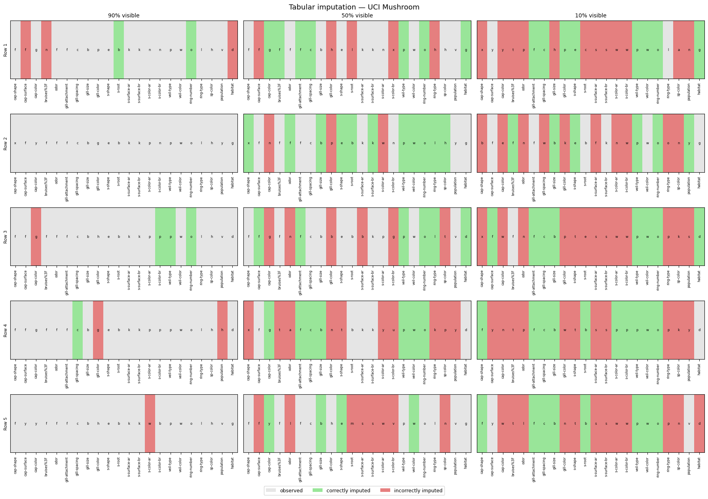

# Order-Agnostic Autoregressive Diffusion Models for Imputation

[](https://www.python.org/)
[](https://pytorch.org/)
[](LICENSE)

An implementation and study of the **Order-Agnostic Autoregressive Diffusion Model (OA-ARDM)**
([Hoogeboom et al., ICLR 2022](https://openreview.net/forum?id=Lm8T39vLDTE)), applied to
image and tabular data imputation.

Instead of generating data in a fixed left-to-right order, ARDM trains a model to predict
any token given any subset of the others, randomising the generation order at every training
step. This makes imputation — filling in missing entries in partially observed data — come
for free at inference time, with no architectural changes.

> Originally developed as a course project for *Probabilistic and Generative Machine Learning*
> (MSc), jointly with Ana Pascual. See [Authorship](#authorship) below.

## Contents

- A **bidirectional Transformer** backbone trained with the ARDM objective on binarized MNIST
- Unconditional generation via sequential and parallel block sampling
- **Imputation** from partially observed images, at 90% / 50% / 10% visibility
- Uncertainty quantification via pixel-wise entropy over repeated completions
- An **architecture comparison** against a small CNN with a local receptive field
- An extension to **tabular data** (UCI Mushroom, 22 categorical features), showing ARDM
  generalises beyond images

## Results

**Training converges well below the random baseline** (ln 2 ≈ 0.693), with train/validation
curves tracking closely throughout:



**Unconditional generation** — sequential sampling (top) produces more coherent digits than
parallel block sampling (bottom), which is ~46x faster:



**Imputation** — reconstructions stay faithful down to 50% visibility, and remain plausible
even at 10%, where the model falls back on the class prior rather than the true digit:



**Uncertainty** — pixel-wise entropy over 50 completions shows the model is confident where
context is strong and uncertain exactly where it should be (stroke boundaries at 50%, most of
the image at 10%):



**Transformer vs. CNN** — with global attention, the Transformer degrades gracefully as
context shrinks, while the CNN's local receptive field breaks down into fragments at 10%
visibility:



**Tabular imputation (UCI Mushroom)** — ARDM transfers to categorical tabular data:
imputation accuracy stays well above the random baseline even with only 10% of features
observed:



## Repository structure

```
.
├── notebooks/
│   └── ardm_imputation.ipynb   # full implementation, training, and analysis
├── assets/                     # result figures used in this README
├── requirements.txt
└── LICENSE
```

## Running the notebook

The notebook was developed and trained on **Google Colab** (GPU runtime) with checkpoints
saved to Google Drive; the imports and save/load paths at the top of each section assume that
environment. To run it elsewhere:

1. Install dependencies:
   ```bash
   pip install -r requirements.txt
   ```
2. Remove/replace the `google.colab.drive` mount cell and point `SAVE_PATH` to a local
   directory.
3. Run top to bottom — MNIST downloads via `torchvision.datasets`, and the Mushroom dataset
   via `sklearn.datasets.fetch_openml`, so no manual data setup is needed. Model weights are
   not included in this repo; re-running training will regenerate the checkpoints used for
   evaluation.

## References

- Hoogeboom, E., Gritsenko, A. A., Bastings, J., Poole, B., van den Berg, R., & Salimans, T.
  (2022). [Autoregressive Diffusion Models](https://openreview.net/forum?id=Lm8T39vLDTE). ICLR.
- Transformer attention blocks build on Andrej Karpathy's
  [minGPT](https://github.com/karpathy/minGPT), wrapped following
  [Buomsoo Kim's Transformer tutorial](https://buomsoo-kim.github.io/attention/2020/04/21/Attention-mechanism-19.md/).

## Authorship

This project was completed jointly with **Ana Pascual** as coursework for the MSc module
*Probabilistic and Generative Machine Learning*. This repository is maintained by
[Cristina Sobrino](https://github.com/crissobrino) for portfolio purposes.

## License

Code in this repository is released under the [MIT License](LICENSE).
